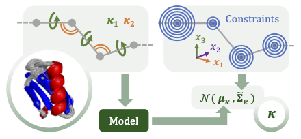
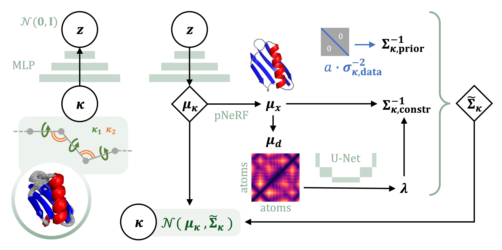

# Internal-Coordinate Density Modelling of Protein Structure: Covariance Matters

This repository corresponds to the paper [Internal-Coordinate Density Modelling of Protein Structure: Covariance Matters](https://openreview.net/forum?id=9XRZtZRmEB).

## Approach
This model generates protein structure fluctuations by sampling from a distribution over **dihedrals** and **bond angles** (bond lengths fixed), while still respecting constraints in **Euclidean space**. 



## Requirements
Dependencies are listed in [VAE_covariane_matters.yml](./VAE_covariane_matters.yml), which can also be used to create a new conda environment:
```
conda env create -f VAE_covariane_matters.yml
```
> [!NOTE]
> 1. You might have to change the versions of pytorch and/or cudatoolkit version based on the system you're running on.
> 2. In case you're running on cpu, comment out the installation of cudatoolkit.

## Data
Our paper considers three types of datasets:
* In-house MD simulation of Protein G (1pga). File [data/df_MD_1pga.npy](data/df_MD_1pga.npy) contains an array with coordinates for the simulation, with corresponding pdb file [data/1pga.pdb](data/1pga.pdb).
* NMR datasets for the human villin headpiece (1unc) and BBA motif (1fsd). These sets are taken directly from the Protein Data Bank and can be found at [data/1unc.pdb](data/1unc.pdb) and [data/1fsd.pdb](data/1fsd.pdb), respectively.
* Fast-folder simulations of chignolin (cln025) and the chicken villin headpiece (2f4k). These datasets are available upon request from the authors of [Lindorff-Larsen et al. (2011)](https://www.science.org/doi/full/10.1126/science.1208351).

## Model architecture
The architecture for the proof-of-concept VAE model introduced in the paper is show below. The main components are a simple MLP-based VAE and a U-Net that predicts Lagrange multipliers as a proxy for atom fluctuations. See [models_and_trainer](./models_and_trainer/) for implementation.



## How to run

> [!IMPORTANT] 
> Logging of training, evaluation metrics, images and run configurations is done using Weights & Biases (wandb). While it is possible to run training without wandb using the `--no_wandb` flag, resuming training and doing evaluation requires a config file. Therefore, to avoid having to construct config files manually, we strongly recommend using wandb, since the config file is then directly available in the wandb directory of the training run (`<path_to_wandb_run_dir>/files/config.yaml`). The directory is also printed at the initialization of each run, so it can easily be retrieved.

### Training
Training is done using the [train_VAE_covmatters.py](./train_VAE_covmatters.py) script. Check `python train_VAE_covmatters.py --help` for a detailed description of all arguments. This script is used to train the main model (VAE with constraints) as well as baselines. Evaluation of atom fluctuations is done at the end of training, but can also be done separately. This is explained under the heading "Evaluation" below, together with a more detailed description of the plots.

#### Running the VAE with constraints
To run the main model presented in the paper, use the basic arguments of the training script. For example for 1pga with a $\kappa$-prior weight 50 and auxiliary $\lambda$ loss weight 25:

```
python main_VAE_dynamics.py \
    --model_name 1pga_a50_lambmae25 \
    --pdb_file_path ./data/1pga.pdb \
    --protein 1pga \
    --epochs 1000 \
    --lr 5e-4 \
    --batch_size 32 \
    --num_warm_up_KL 200 \
    --num_mean_only 100 \
    --a_weight 50 \
    --lambda_aux_weight 25 \
    --num_samples_z 1000 \
    --wandb_project <project_name>
```

#### Running baselines
The same training script is used to train the two baselines:
1. VAE $\kappa$-prior (fixed): a baseline where we don't add constraints, and just keep the fixed diagonal prior as the covariance matrix. To train this baseline, choose an appropriate value for `--a_weight` and add the flag `--constraints_off`.
2. VAE $\kappa$-prior (learned): a baseline for which the prior is learned directly, without the imposed constraints. To train this baseline, add the flags `--constraints_off` and `--predict_prior`.

> [!NOTE]
> 1. For the normalizing flow baseline, we refer to the [github repository](https://github.com/noegroup/flowm) made by the authors of the corresponding [paper](https://arxiv.org/abs/2203.11167).
> 2. There is also a `--constraints_only` flag which can be used to train the VAE without the prior, only using constraints. This setting was added for exploratory purposes, and it makes training highly unstable.

#### Extending training
To extend training beyond the last saved checkpoint, use the [resume_training.py](./resume_training.py) script, see `--help` for options. The main input you need here is the path to the config file, which is saved in the run dir of the previous training run: `<path_to_wandb_run_dir>/files/config.yaml`.


### Evaluation
#### Evaluating fluctuations
The [eval_VAE_covmatters.py](./eval_VAE_covmatters.py) script (see `--help` for options) takes the config file of a training run (`<path_to_wandb_run_dir>/files/config.yaml`) and produces the same plots that are made by default at the end of training:
* "sample plot", containing:
    1. A visualization of the precision matrix (1 mean, 1 random sample)
    2. A 2D visualization of latent space
    3. Dihedral distributions and a Ramachandran plot\
    4. Mean and standard deviation for pairwise distances
* "atomfluct_plot", containing:
    1. Atom fluctuation comparison (non-superposed) between the VAE samples and constraints $C$. See Appendix C of [our paper](https://openreview.net/forum?id=9XRZtZRmEB) for a more detailed explanation.
    2. Non-superposed fluctuation comparison between the VAE samples and the reference.
    3. Superposed fluctuation comparison between VAE samples, reference, prior only, and standard covariance estimator. Zoomed-in and zoomed-out version.
    4. $C$ vs $\lambda$ scatterplots.

> [!NOTE]
> The reference for the sample plot can be created using the [TICA_and_GTfluct/GTfluct_plot.py](./TICA_and_GTfluct/GTfluct_plot.py) script.

#### TIC analysis
In order to do TICA, the reference TICA model needs to be created first using [TICA_and_GTfluct/fit_GT_TICA.py](./TICA_and_GTfluct/fit_GT_TICA.py). This TICA model can then be applied to standard estimator samples and VAE samples (with constraints as well as baselines) using [TICA_and_GTfluct/TICA_npcov_circmean.py](./TICA_and_GTfluct/TICA_npcov_circmean.py) and [TICA_and_GTfluct/TICA_samples.py](./TICA_and_GTfluct/TICA_samples.py), respectively. The main argument for these scripts is again the wandb config from the corresponding training run `<path_to_wandb_run_dir>/files/config.yaml`.

#### Samples
Samples for the VAE and different baselines used to create [supplementary Figure A2](./samples/FigA2_samples.pdf) of the paper can be found in [samples](./samples/).

## Cite
Please cite the following paper when using this code base:

```bibtex
@article{
arts2024internalcoordinate,
title={Internal-Coordinate Density Modelling of Protein Structure: Covariance Matters},
author={Marloes Arts and Jes Frellsen and Wouter Boomsma},
journal={Transactions on Machine Learning Research},
issn={2835-8856},
year={2024},
url={https://openreview.net/forum?id=9XRZtZRmEB},
note={}
}
```